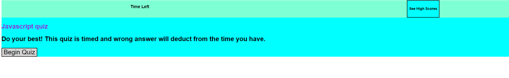

# Quiz
## Description
### This was a project for DU's coding boot camp. This really testing my ability to apply JavaScript to make a functional quiz. I'm still learning on how to style from a JS heavy format but feel like my skills will improve with practice. I struggled with naming my functions and their attributes and had to redo a lot along the way.

## Credits 
### I want to thank my teacher and TA's with helping me learn the concepts through this course. I used a lot of online resources and the students in my class were also super helpful and explained things ina  way that made sense. 

## Deployed Site
https://alester77.github.io/Quiz/

## Screenshot of quiz
